 

## 👋 About Me

IT student and full-stack developer who enjoys taking a product from idea to something people can actually use — React and Tailwind on the frontend, FastAPI and PostgreSQL on the backend, Flutter for mobile. I learn best by shipping real projects rather than tutorials, and I'm currently deepening my backend and mobile skills.

- 🔭 Currently building **[CodeCrew Blog](https://github.com/Devlynxz/codecrew-blog)** and **[MateSpace](https://github.com/Devlynxz/matespaceprod-app)**
- 🤝 Collaborated with the **Codecrew Seekers** team on a full-stack blogging platform
- 🎯 Goal: build software that solves real-world problems

 

## 🛠️ Tech Stack

**Frontend**
 

**Mobile**
 

**Backend**
 

**Database & Cloud**
 

**Tools**
 

 

## 🚀 Featured Projects

- **[CodeCrew Blog](https://github.com/Devlynxz/codecrew-blog)** — Full-stack blogging platform with JWT authentication. React + Tailwind CSS frontend, FastAPI + PostgreSQL backend (SQLModel, bcrypt password hashing). Built with the Codecrew Seekers team.
- **[MateSpace](https://github.com/Devlynxz/matespaceprod-app)** — Personal productivity app built with Flutter, GetX, and Firebase. Task management with drag-to-prioritize, budget tracking with charts, notes, calendar, Google Sign-In, and push notifications.

 

## 📊 GitHub Stats

<picture>
  <source media="(prefers-color-scheme: dark)" srcset="https://raw.githubusercontent.com/Devlynxz/Devlynxz/output/github-contribution-grid-snake-dark.svg" />
  <source media="(prefers-color-scheme: light)" srcset="https://raw.githubusercontent.com/Devlynxz/Devlynxz/output/github-contribution-grid-snake.svg" />
  
</picture>

 

## 🌱 Currently Learning

 

## 📫 Let's Connect

 

